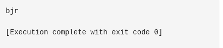

# MiniTradosGo
mini traducteur avec Go

### traduire un text normal en langage sms

```go

package main

import "fmt"
import "strings"

func Translate(phrase string) string {
    motsFR := []string{"bonjour", "salut"} // a completer
    motsFB := []string{"bjr", "slt"} //

    for i := 0; i < len(motsFR); i++ {
        phrase = strings.ReplaceAll(phrase, motsFR[i], motsFB[i])
    }

    return phrase
}

func main() {
     text := "bonjour"
    fmt.Println(Translate(text))
}

```


### vous pouvez utiliser cette approche dpour traduire des textes en langue local etc.

Disponible en d'autres langages
<hr>
<a href="https://github.com/samglish/traduction_francais_fulfude"> mini traducteur java </a> &nbsp;&nbsp;&nbsp;&nbsp;
<a href="https://github.com/samglish/traduction_par_dictionnaires_python">mini traducteur python </a> &nbsp;&nbsp;&nbsp;&nbsp;
<a href="https://github.com/samglish/mini_traducteur_kotlin">mini traducteur kotlin </a>